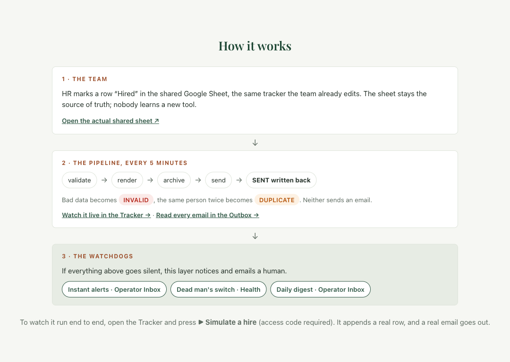
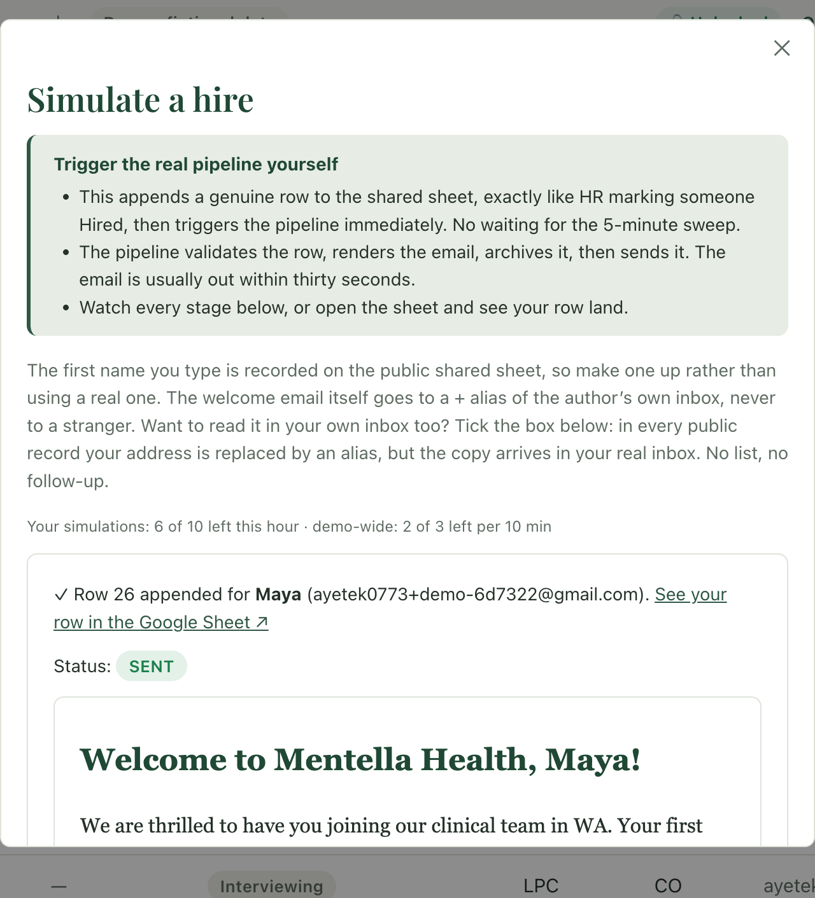
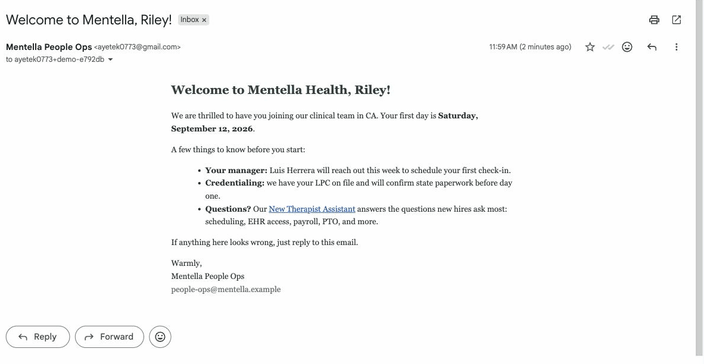

# Welcome Copilot

HR marks a row "Hired" in a shared Google Sheet. This system sends the welcome email, keeps proof of every send, and alerts a human the moment anything stops working.

**[Live demo](https://welcome-copilot.vercel.app)** · **[Walkthrough PDF](https://welcome-copilot.vercel.app/walkthrough.pdf)** (8 pages, all screenshots from the live system)

> Unofficial demo built for Mentella Health's application task. All people and policies are fictional, and every recipient address is a + alias of the author's own inbox.

## How it works



Two ways in: edit the sheet by hand (picked up within 5 minutes), or press **▶ Simulate a hire** in the console (triggers the same pipeline immediately). Either way the Sheet stays the single source of truth: the console reads it through a service account, the bound Apps Script owns all pipeline writes, and the two never talk to each other directly.

## What it looks like

One button press, about thirty seconds, one real email:

<p>
  
  
</p>

The console also has a sortable live **Tracker** with expandable candidate rows, an **Outbox** of every email archived before it was sent, an **Operator Inbox** of the alerts and digests the pipeline mails its human, a **Health** page with a dead-man's-switch badge, and an **Assistant** that answers onboarding questions from a 9-doc handbook with citations, a browsable source rail, and honest refusals.

## Why it doesn't fall over

- **Never sends twice.** The sheet itself records every send, keyed by hire ID rather than row position. Re-sort it, edit it, crash mid-run: a sent row stays sent.
- **At-most-once.** A `SENDING` marker is flushed to the sheet before Gmail is called. A crash mid-send waits for a human instead of auto-retrying into a double send.
- **Fails closed.** Anything other than an explicit `dry_run = FALSE` means drafts, never live mail. A quota guard stops sends before Gmail's daily limit.
- **Bad data is loud.** A typo'd address becomes `INVALID`, a pasted duplicate becomes `DUPLICATE`, and neither sends. Two such rows are staged in the live sheet on purpose.

And three ways to hear about a failure, because monitoring that depends on the thing it watches isn't monitoring: instant error alerts, a [healthchecks.io](https://healthchecks.io) dead-man's-switch that catches *silence* (dead trigger, revoked auth), and a plain-English daily digest.

## The assistant, briefly

MiniSearch full-text retrieval over nine Markdown docs (deliberately no vector database at this size), `claude-haiku-4-5` answering only from the retrieved excerpts, citations on every answer, and "I'm not sure" instead of guessing. The four suggested questions are served from a prebaked cache at zero API cost; free-form questions sit behind an access code plus rate caps, and every limit shows a live remaining count.

There's also a no-API slice at `/console/utilization`: two mock CSV billing exports validated loudly, run through one readable SQL query, and published as a static report, because several core clinical and billing systems in a real practice have no API at all.

## Repo layout

| Path | Contents |
|---|---|
| `apps-script/` | The pipeline: validation, rendering, sending, monitoring. Managed with `clasp`. |
| `web/` | Next.js ops console and the handbook assistant. |
| `docs/` | [The original sketch](docs/sketch.md), an [operator RUNBOOK](docs/RUNBOOK.md), [design decisions](docs/design.md), [tracker-at-scale notes](docs/tracker-v2.md), and the [walkthrough](docs/walkthrough/). |

## Running it yourself

<details>
<summary>Prerequisites and environment variables</summary>

You need: a Google Sheet with a bound Apps Script project (pushed with [`clasp`](https://github.com/google/clasp)), a GCP service account shared as Editor on that Sheet, a Vercel account for `web/`, an [Upstash](https://upstash.com) Redis database, and an Anthropic API key.

Environment variables (`web/.env.local` locally, Vercel project env vars for deploys):

| Variable | Description |
|---|---|
| `SHEET_ID` | The Google Sheet ID the console reads from. |
| `GOOGLE_SA_KEY_PATH` | Path to the service account JSON key file (local dev only). |
| `GOOGLE_SA_KEY_B64` | Base64-encoded service account JSON key (deploys, in place of the path). |
| `ANTHROPIC_API_KEY` | Anthropic API key for the assistant. |
| `UPSTASH_REDIS_REST_URL` | Upstash Redis REST endpoint, for rate limiting. |
| `UPSTASH_REDIS_REST_TOKEN` | Upstash Redis REST token. |
| `DEMO_ACCESS_CODE` | Invite code gating free-form questions and Simulate. |
| `HEALTHCHECKS_BADGE_URL` | Optional. Public status badge URL shown on the Health page. |
| `GAS_WEBHOOK_URL` | Optional. Apps Script web-app URL that `/api/simulate` pokes for an instant run. |
| `SIMULATE_TOKEN` | Required alongside `GAS_WEBHOOK_URL`. Shared secret, matching the Script Property of the same name. |
| `AUDIT_SHEET_ID` | Optional. Private Sheet that logs unlocks, questions, and simulate runs. Unset disables auditing. |

```
cd web
npm install
npm run dev
```

</details>

## Stack

Google Apps Script (pipeline) · Next.js + React (console) · MiniSearch + Claude Haiku (assistant) · Upstash Redis (rate limiting) · Vercel (hosting).

MIT licensed. See [LICENSE](LICENSE).
