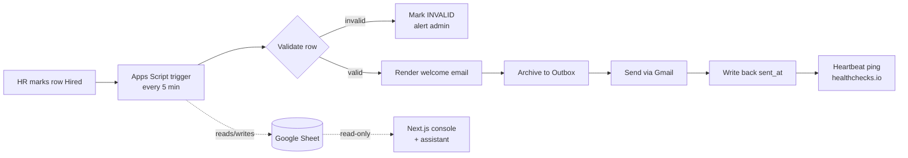

# Welcome Copilot

From "Hired" in a shared spreadsheet to a personalized welcome email, an onboarding assistant, and an ops console — automatically, reliably, observably.

> Unofficial demo built in response to Mentella Health's application task. All people, emails, and policies are fictional; recipient addresses are + aliases of the author's own inbox.

## Live demo

**[welcome-copilot.vercel.app](https://welcome-copilot.vercel.app)**

What to try:

- Watch the **Tracker** — hires move through the pipeline in near-real time.
- Open an email in the **Outbox** — every send is archived byte-for-byte, drafts included.
- Check **Health** — the pipeline's dead-man's-switch, quota, and run log.
- Ask the assistant one of its suggested questions — answered from the handbook with citations, no API cost.

Free-form questions are gated behind an access code from the application materials.

## How it works



The Apps Script pipeline and the Next.js console never talk to each other directly — they share state only through the Sheet, one read-only via a service account, one read-write via the bound script.

## Reliability, by design

- **Idempotency** — a non-empty `welcome_sent_at` means done, forever. No re-sends on re-runs.
- **At-most-once sends** — the row is stamped `SENDING` and flushed to the sheet *before* `GmailApp.sendEmail` is called, so a crash mid-send never leaves an email both unsent and unmarked.
- **Writes keyed by `hire_id`, not row position** — the sheet gets sorted and edited by people mid-run; every write re-locates its row by id first.
- **Fail-closed dry-run** — anything other than `FALSE` in the config means drafts, never live mail.
- **Quota guard** — the run stops before Gmail's daily send quota is exhausted and picks up the remaining rows next cycle.

## You'd know if it broke

Three independent defenses, because monitoring that depends on the thing it's watching isn't monitoring:

1. **Instant error alerts** — invalid rows and pipeline exceptions email the admin the moment they happen.
2. **Dead-man's-switch** — a heartbeat ping to [healthchecks.io](https://healthchecks.io) after every run. It watches for *silence*, so a disabled trigger, an expired auth token, or a dead script gets caught even though nothing "errored."
3. **Daily digest** — a plain-English summary (sent, drafted, invalid, errors, quota holds, rows stuck in `SENDING`) so a human doesn't have to read the log to know the day was normal.

## The assistant

**Retrieval:** [MiniSearch](https://github.com/lucaong/minisearch) over the handbook's Markdown files, chunked by section. Deliberately no vector database — at nine documents, a full-text index is simpler, faster to iterate on, and has nothing to deploy. That trade-off flips once the corpus needs semantic matching across paraphrased questions or grows past what a single in-memory index can hold comfortably; either is the signal to move to embeddings.

**Generation:** `claude-haiku-4-5`, answering only from the retrieved excerpts, with inline citations and instructions to say "I'm not sure" rather than guess.

**Cost containment**, layered so most traffic never reaches the API:

- The four suggested questions are answered from a prebaked cache — zero API calls.
- Free-form questions require an invite code.
- Per-IP and daily global rate caps sit behind the code as defense-in-depth.

## Repo layout

| Path | Contents |
|---|---|
| `apps-script/` | The pipeline: validation, rendering, sending, monitoring. Managed with `clasp`. |
| `web/` | Next.js ops console (Tracker, Outbox, Health) and the handbook assistant. |
| `docs/` | Design docs — coming with the final submission. |

## Running it yourself

Prerequisites:

- A Google Sheet with an Apps Script project bound to it, pushed with [`clasp`](https://github.com/google/clasp).
- A GCP service account, shared read-only on that Sheet, for the console.
- A Vercel account to deploy `web/`.
- An [Upstash](https://upstash.com) Redis database for rate limiting.
- An Anthropic API key.

Environment variables (`web/.env.local` for local dev, Vercel project env vars for deploys):

| Variable | Description |
|---|---|
| `SHEET_ID` | The Google Sheet ID the console reads from. |
| `GOOGLE_SA_KEY_PATH` | Path to the service account JSON key file (local dev only). |
| `GOOGLE_SA_KEY_B64` | Base64-encoded service account JSON key (deploys, in place of the path). |
| `ANTHROPIC_API_KEY` | Anthropic API key for the assistant. |
| `UPSTASH_REDIS_REST_URL` | Upstash Redis REST endpoint, for rate limiting. |
| `UPSTASH_REDIS_REST_TOKEN` | Upstash Redis REST token. |
| `DEMO_ACCESS_CODE` | Invite code gating free-form assistant questions. |
| `HEALTHCHECKS_BADGE_URL` | Optional. Public status badge URL shown on the Health page. |

```
cd web
npm install
npm run dev
```

## Stack

Google Apps Script (pipeline) · Next.js + React (console) · MiniSearch + Claude Haiku (assistant) · Upstash Redis (rate limiting) · Vercel (hosting).

MIT licensed — see [LICENSE](LICENSE).
